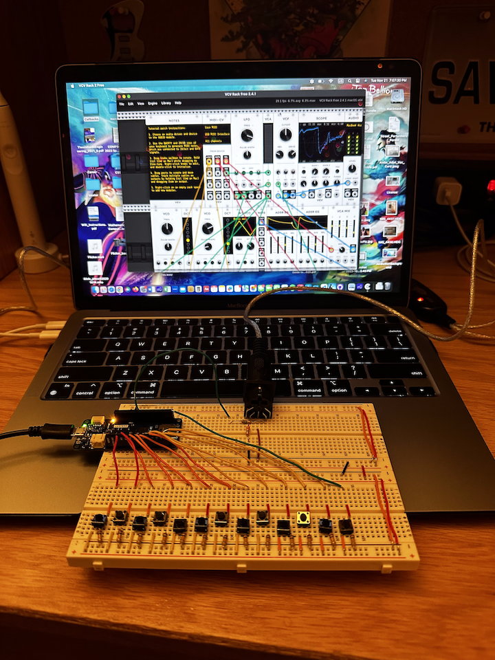

# Arpeggiator

The Arpeggiator features a keyboard interface that allows the user to play a chord that the instrument arpeggiates. That is,
it cycles through each note in the chord for as long as the user plays it. It consists of a breadboard circuit, Arduino Uno, MIDI connector,
and the VCV Rack Mac application, which receives the MIDI input and turns it into sound.
